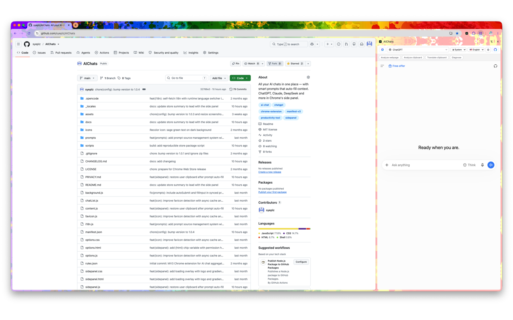
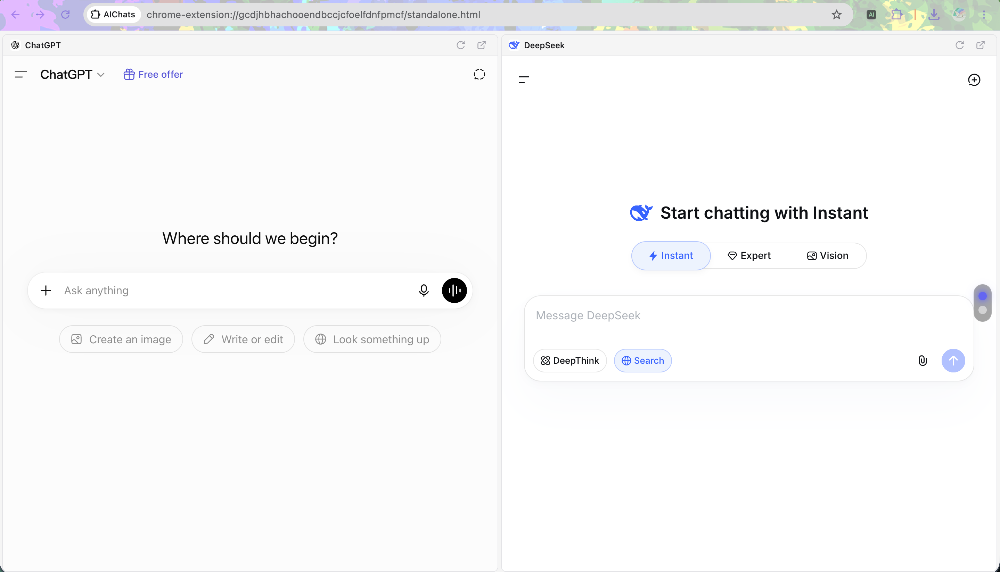
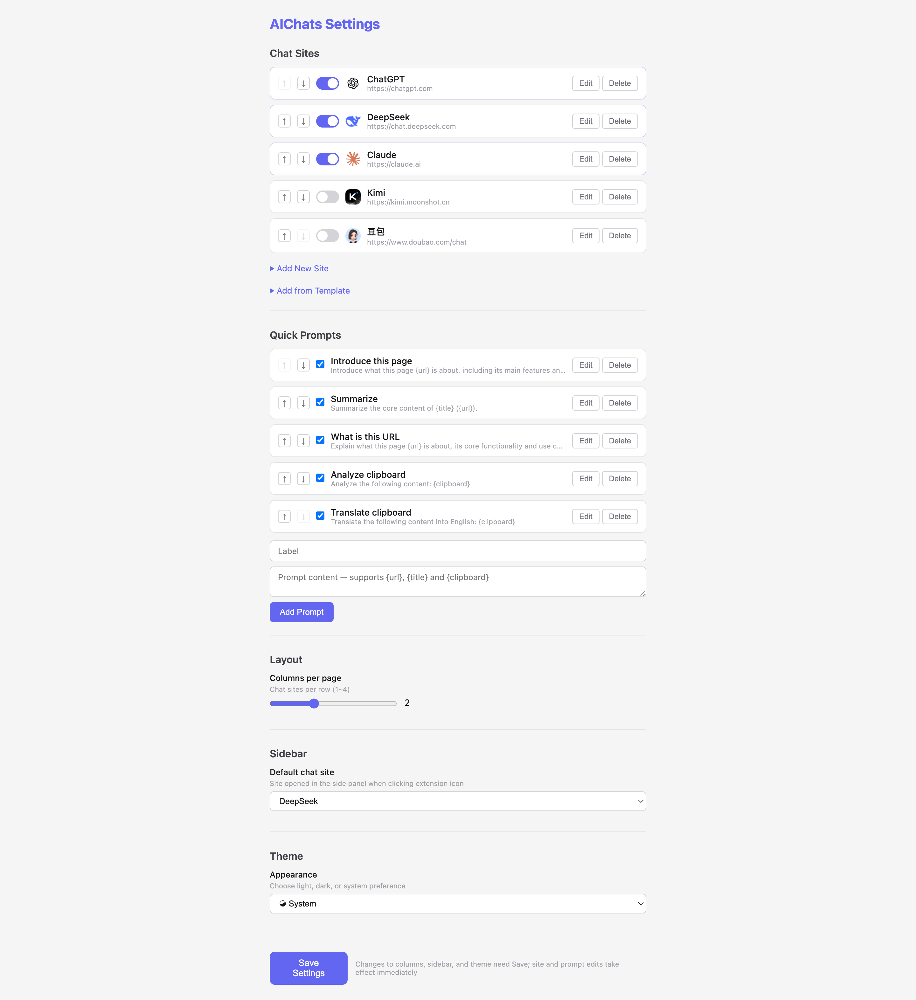

# AIChats

**Embed multiple AI chat websites in a single view** — switch between ChatGPT, DeepSeek, Claude, Kimi, Doubao and more from Chrome's side panel or a standalone grid view, with smart quick prompts to speed up your workflow.

[](LICENSE)
[](https://chromewebstore.google.com/detail/bflhgadnamnmpcpjhgcimnioelhbacpd)
[](https://github.com/syeplz/AIChats)

> **Other languages:** [简体中文](docs/readme/README.zh_CN.md)

---

## Features

### Side Panel
Open AI chats in Chrome's side panel with a dropdown to instantly switch between sites. No need to juggle tabs.

### Grid View
Launch multiple AI chats simultaneously in a full-page gallery view. Scroll-snapping per screen for easy comparison across different models.

### Quick Prompts
Pre-built template prompts that auto-fill with your current page context. Supports `{url}`, `{title}` and `{clipboard}` variables — click a chip to copy the expanded prompt to your clipboard, ready to paste into any AI chat.

### Customizable
- Add any AI chat website you like
- Rearrange and toggle sites on/off
- Create your own quick prompt templates
- Custom favicon auto-detection

### Themes
Dark (default), Light, or follow your system preference.

### i18n
English and Simplified Chinese with a runtime language switcher.

---

## Installation

### From Chrome Web Store
[Install from Chrome Web Store](https://chromewebstore.google.com/detail/bflhgadnamnmpcpjhgcimnioelhbacpd)

### Manual (Developer Mode)
1. Download or clone this repository:
   ```bash
   git clone https://github.com/syeplz/AIChats.git
   ```
2. Open Chrome and go to `chrome://extensions`
3. Enable **Developer mode** (toggle in top-right)
4. Click **Load unpacked**
5. Select the `AIChats` folder

---

## Usage

1. Click the AIChats icon in the Chrome toolbar to open the side panel
2. Use the dropdown to switch between AI chat sites
3. Click the **⊞** button to open the grid view with all enabled sites
4. Use the **Quick Prompts** chips to copy pre-built prompts to your clipboard
5. Right-click the icon and select **Options** to customize sites, prompts, layout, and theme

---

## Screenshots

| Side Panel | Grid View | Settings |
|---|---|---|
|  |  |  |

---

## Privacy

AIChats does **not** collect, store, or transmit any personal data. All data is stored locally via `chrome.storage.sync`. See [PRIVACY.md](PRIVACY.md) for details.

---

## License

[MIT](LICENSE)

---

## Contributing

Contributions are welcome! Please open an [issue](https://github.com/syeplz/AIChats/issues) or submit a pull request.
