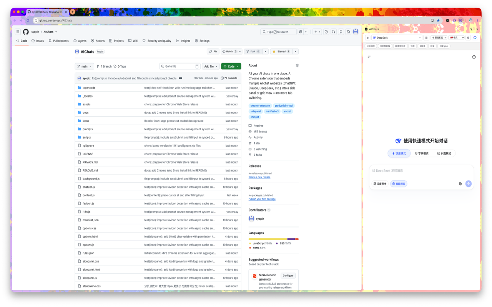
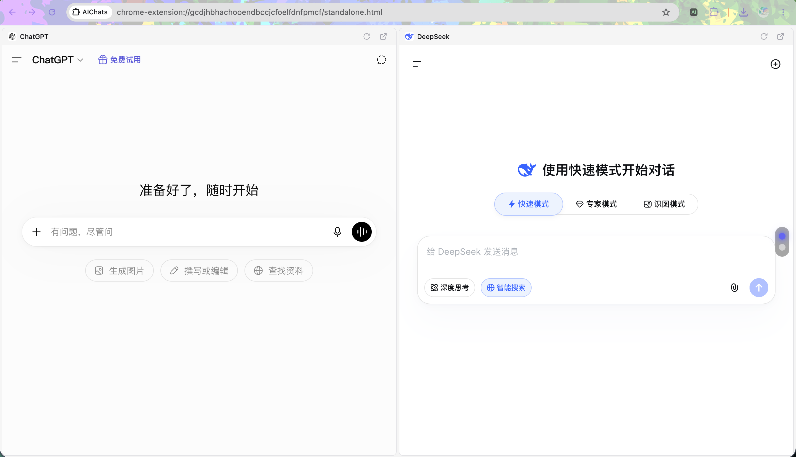
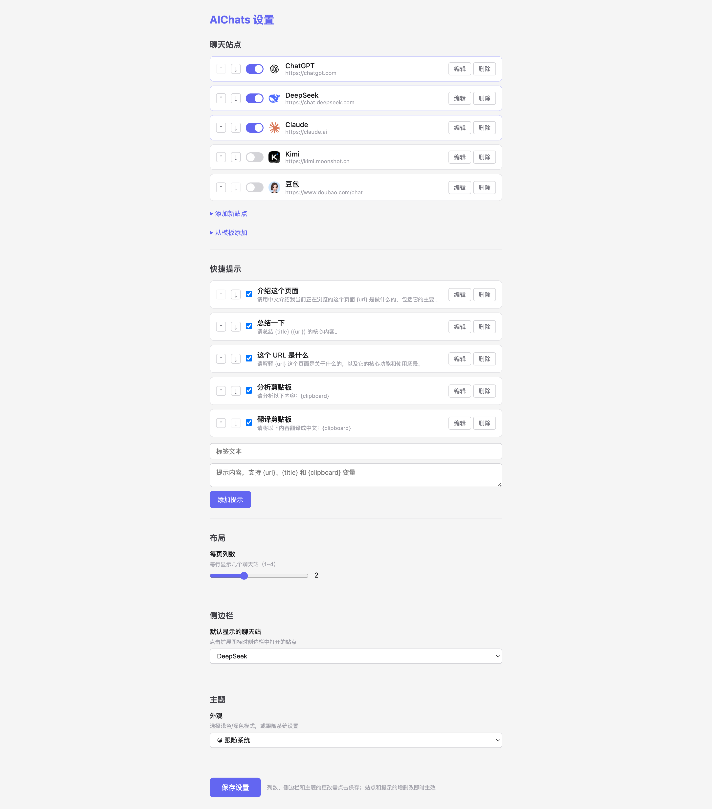

# AIChats

**在单一视图中嵌入多个 AI 聊天网站** — 在 Chrome 侧栏或独立网格视图中快速切换 ChatGPT、DeepSeek、Claude、Kimi、豆包等 AI 聊天，内置智能快捷提示提升效率。

[](../../LICENSE)
[]()
[](https://github.com/syeplz/AIChats)

> **其他语言:** [English](../../README.md)

---

## 功能特性

### 侧栏模式
在 Chrome 侧栏中打开 AI 聊天，通过下拉菜单在站点间快速切换，无需管理多个标签页。

### 网格视图
同时打开多个 AI 聊天站点，全屏画廊模式分屏展示。支持按屏轮播，方便对比不同模型的回答。

### 快捷提示
预设模板化提示词，自动填充当前页面上下文。支持 `{url}`、`{title}` 和 `{clipboard}` 变量 — 点击芯片即可将处理后的提示复制到剪贴板，直接粘贴到任意聊天框。

### 灵活定制
- 添加任意 AI 聊天网站
- 自由排序、启用/禁用站点
- 创建自定义快捷提示模板
- 站点图标自动检测

### 主题
深色（默认）、浅色、跟随系统。

### 多语言
支持简体中文和 English，运行时一键切换。

---

## 安装

### 从 Chrome 网上应用店
*即将上线。*

### 手动安装（开发者模式）
1. 下载或克隆本仓库：
   ```bash
   git clone https://github.com/syeplz/AIChats.git
   ```
2. 打开 Chrome，访问 `chrome://extensions`
3. 开启右上角的 **开发者模式**
4. 点击 **加载已解压的扩展程序**
5. 选择 `AIChats` 文件夹

---

## 使用方法

1. 点击 Chrome 工具栏中的 AIChats 图标打开侧栏
2. 使用下拉菜单切换 AI 聊天站点
3. 点击 **⊞** 按钮打开网格视图，查看所有已启用的站点
4. 使用快捷提示芯片一键复制处理后的提示到剪贴板
5. 右键点击图标 → **选项**，自定义站点、提示、布局和主题

---

## 截图

| 侧栏 | 网格视图 | 设置 |
|---|---|---|
|  |  |  |

---

## 隐私

AIChats **不会**收集、存储或传输任何个人数据。所有数据通过 `chrome.storage.sync` 存储在本地。详见 [PRIVACY.md](../../PRIVACY.md)。

---

## 许可证

[MIT](../../LICENSE)

---

## 贡献

欢迎贡献！请提交 [Issue](https://github.com/syeplz/AIChats/issues) 或 Pull Request。
